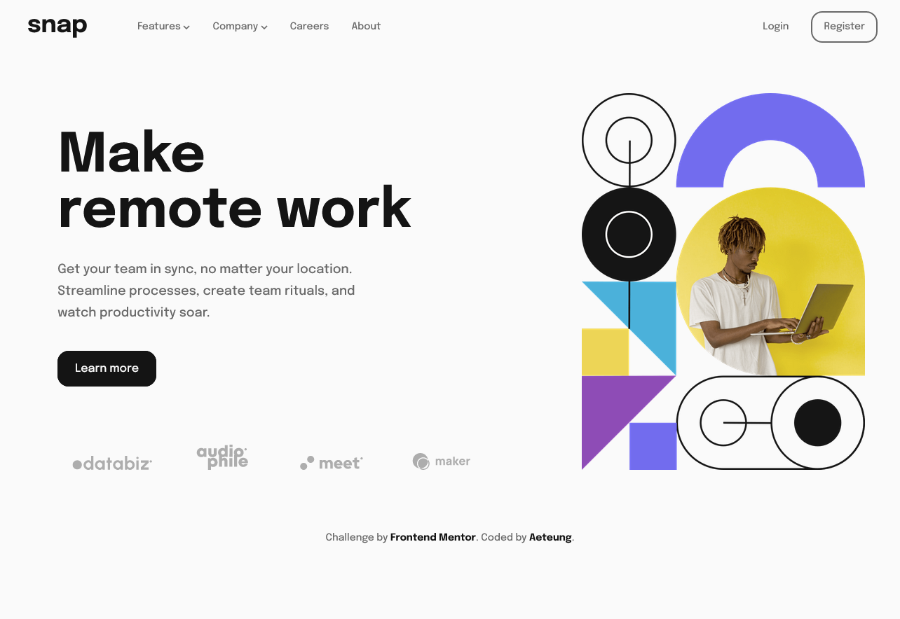

# Frontend Mentor - Intro section with dropdown navigation solution

This is a solution to the [Intro section with dropdown navigation challenge on Frontend Mentor](https://www.frontendmentor.io/challenges/intro-section-with-dropdown-navigation-ryaPetHE5). Frontend Mentor challenges help you improve your coding skills by building realistic projects. 

## Table of contents

- [Overview](#overview)
  - [The challenge](#the-challenge)
  - [Screenshot](#screenshot)
  - [Links](#links)
- [My process](#my-process)
  - [Built with](#built-with)
  - [What I learned](#what-i-learned)
  - [Continued development](#continued-development)
  - [Useful resources](#useful-resources)
- [Author](#author)
- [Acknowledgments](#acknowledgments)

## Overview

### The challenge

Users should be able to:

- View the relevant dropdown menus on desktop and mobile when interacting with the navigation links
- View the optimal layout for the content depending on their device's screen size
- See hover states for all interactive elements on the page

### Screenshot



### Links

- Solution URL: [Add solution URL here](https://your-solution-url.com)
- Live Site URL: [Add live site URL here](https://your-live-site-url.com)

## My process

### Built with

- Semantic HTML5 markup
- SCSS via npm
- Flexbox
- CSS Grid
- Mobile-first workflow
- Event Listener in JS
- Git version control with Git command via Bash

### What I learned

- Using &nbsp; instead of " " to fill in the content in order to prevent the content block shrinks down.
```html
<a href="#our_team" class="dropdown-link">Our&nbsp;Team</a>
```

- Set the viewbox and height/width to align icons in the dropdown.
```html
<svg class="dropdown-icon" preserveAspectRatio="none" viewbox="-1 0 16 16" xmlns="http://www.w3.org/2000/svg"><path d="M14 3v12a1 1 0 0 1-1 1H1a1 1 0 0 1-1-1V3a1 1 0 0 1 1-1h1V1a1 1 0 1 1 2 0v1h2V1a1 1 0 1 1 2 0v1h2V1a1 1 0 0 1 2 0v1h1a1 1 0 0 1 1 1Zm-2 3H2v1h10V6Zm0 3H2v1h10V9Zm0 3H2v1h10v-1Z" fill="#726CEE"/></svg>
```
```css
.dropdown-icon {
    height: 1em;
    width: 1em;
    margin-right: 1em;
}
```

- Using the clamp function to give an upper and lower limit for a size
```scss
& > div {
    margin: 2rem clamp(2rem, 7vw, 6rem) 2rem clamp(2rem, 5vw, 4.5rem);
    grid-template-rows: 7fr 4fr 3fr 4fr;
    & > * {
        display: flex;
        align-items: flex-end;
    }
}
```

### Continued development

- SEO enhancement
- Cross-brower adaptiveness
- Loading Speed enhancement
- Weird scrollbar in Chrome


### Useful resources

- [Responsive Web Design - freeCodeCamp](https://www.freecodecamp.org/learn/2022/responsive-web-design/#learn-intermediate-css-by-building-a-picasso-painting) - This is an amazing free course which helped me get used to html tags and css attribute. I'd recommend it to anyone who wants to start to learn Frontend basic.

- [Conquering Responsive Layouts Course](https://courses.kevinpowell.co/conquering-responsive-layouts) - This helped me so much for me to start my journey on frontend. I learned navigation bar, css flexbox and some basic designing principles via this free course.

- [Learn JavaScript by Building 7 Games](https://www.youtube.com/watch?v=ec8vSKJuZTk&ab_channel=freeCodeCamp.org) - When I started building these games, I had 0 knowledge about what frontend JavaScript looks like and how they worked. I still found it useful and easy to follow. I learned some concepts like eventListener, DOM and etc.

## Author

- Frontend Mentor - [@Aeteung](https://www.frontendmentor.io/profile/Aeteung)

## Acknowledgments

Special thanks to Kevin Powell(https://www.youtube.com/kepowob/videos). His content always informative and inspirational.

